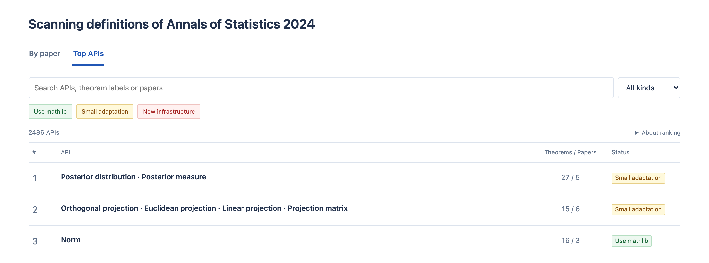

# How far are we to formalize Annals of statistics?

<a class="dashboard-cta" href="../experiments/aos-2024/report.html?view=apis">Explore the interactive dashboard</a>
Search 113 papers and 2,486 APIs.

I have been working on StatLib and thinking about where a statistical library in Lean
should start. One way to approach this is to look at the mathematics that papers actually
use: which definitions recur, which theorems depend on them, and how much of that material
mathlib already supports.

I built three reusable agent skills to help with this, and tried them on the 2024 volume
of the *Annals of Statistics*. The saved experiment covers **113 papers, 637 main-text
Theorems and 2,486 grouped interfaces**. An interface here is a definition, construction
or mathematical condition that we might want to express in Lean.

[Explore the report](../experiments/aos-2024/report.html?view=apis)
or [browse the audit material](../experiments/aos-2024/README.md).

## Starting with two papers

I first worked through the workflow and reader in detail on two papers:
[Gromov–Wasserstein distances: Entropic regularization, duality and sample complexity](https://arxiv.org/pdf/2212.12848v3)
and [Wasserstein convergence in Bayesian and frequentist deconvolution models](https://arxiv.org/pdf/2309.15300v1).
That trial contained 11 Theorems and 35 grouped interfaces.

The review involved checking statements against the source PDFs, tracing how definitions
enter the theorems, inspecting related mathlib declarations, and revising the HTML reader.
I then used the workflow for the larger, agent-assisted run. The scope is results labeled
**Theorem** in the main text; appendices, Lemmas, Propositions and Corollaries are outside
this inventory.

## What the ranking shows

The report has two views: papers and APIs. Selecting an API opens its original source
passages, related theorem statements and recorded mathlib comparisons. You can follow
the evidence behind an entry instead of relying on its title or color.

Within each group, APIs are ranked by direct paper uses, then direct theorem uses. The
displayed **Theorems / Papers** counts also include indirect dependencies, with each
theorem and paper counted once. This is a way to see recurring demand; frequency alone
does not decide what is most valuable to formalize.

There are three work estimates:

- **Green — Use mathlib:** the interface can be expressed with existing operations;
  no new mathematical proof is needed for that interface.
- **Yellow — Small adaptation:** the mathematical ingredients exist, but a representation
  change or compatibility proof remains.
- **Red — New infrastructure:** a required construction or core result still needs to
  be developed.

The distinction is about the missing mathematics. A short definition does not necessarily
mean there is a gap, and a missing core theorem remains a gap even if it can be proved
from mathlib's foundations. Counting lines of Lean, or checking whether something can be
written as an `abbrev`, would not give us this distinction.

These labels concern the interface being audited. They do not say that every theorem
using it has been proved in Lean.

## What you can reuse

The [three skills](../README.md#reusable-skills) cover separate stages:

- `statistical-paper-census` collects source statements and maps their dependencies.
- `ranked-mathlib-audit` searches a pinned mathlib revision and records matches and gaps.
- `statistical-census-html` turns those records into the searchable report.

The release includes the full experiment, public review summaries and the underlying audit
records. I have left
out the PDFs, private logs and local machine paths. Paper links and source hashes remain
so readers can identify the versions used.

## What still needs checking

The detailed two-paper review does not establish the accuracy of all 113 papers. The
larger run is agent-assisted, and its source interpretations, groupings and library
matches need scrutiny. The audit records 542 green, 1,790 yellow and 154 red entries.
Some labels were reassessed from stored evidence, and the boundary above was clarified
afterward; not every older label has been checked again under that clarification.

The library search uses a [fixed mathlib revision](https://github.com/leanprover-community/mathlib4/tree/4edb0dbaa3b3cf729d86d1e2f035474d5ae2ac09).
This is a snapshot, and no paper theorem is
claimed to have been formally proved by this project. The [review summary](../docs/review-summary.md)
explains the scope and links to unresolved source questions.

I hope this helps people choose useful pieces of statistical infrastructure to work on.
Corrections are welcome, especially when you can point to a source statement, a missed
mathlib declaration, or a concrete reason to change an entry's work estimate.
